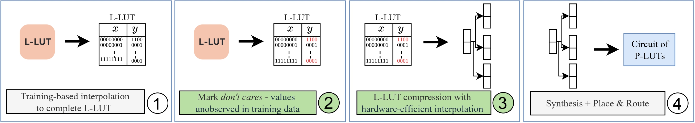

# ReducedLUT: Table Decomposition with "Don't Care" Conditions 
[](https://doi.org/10.1145/3706628.3708823) [](https://arxiv.org/abs/2412.18579) <a href="https://doi.org/10.5281/zenodo.14499541"></a> 


Lookup tables (LUTs) are frequently used to efficiently store arrays of precomputed values for complex mathematical computations. When used in the context of neural networks, these functions exhibit a lack of recognizable patterns which presents an unusual challenge for conventional logic synthesis techniques. ReducedLUT is a tool for the compression of lookup tables and generation of their hardware files in Verilog for RTL designs, as we demonstrated across multiple machine learning applications where don't care conditions were leveraged for greater compression. The toolflow presented in this repository showcases how the results used in the ReducedLUT paper were obtained based on NeuraLUT models, and how the ReducedLUT algorithm can be effectively used. This toolflow achieved upto a 39% compression on NeuraLUT models for no more than a loss of 0.01% test accuracy as presented in our paper.

This code is part of a publication in the ACM/SIGDA International Symposium on Field-Programmable Gate Arrays 2025, which is available in the [ACM digital library](https://dl.acm.org/doi/10.1145/3706628.3708823) and on [arXiv](https://arxiv.org/abs/2412.18579). The ReducedLUT repository containing the L-LUT compression artifact and detailing its specific use can be found [here](https://github.com/ollycassidy13/ReducedLUT).
> Oliver Cassidy, Marta Andronic, Samuel Coward, and George A. Constantinides. 2025. ReducedLUT: Table Decomposition with "Don't Care" Conditions. In Proceedings of the 2025 ACM/SIGDA International Symposium on Field Programmable Gate Arrays (FPGA '25). Association for Computing Machinery, New York, NY, USA, 36–42. https://doi.org/10.1145/3706628.3708823

## ⚠️ Installation

This section describes the steps required to set up your environment, install necessary dependencies, and configure the project for use.

### Install Conda

Download and install [Miniconda](https://docs.conda.io/en/latest/miniconda.html) or [Anaconda](https://www.anaconda.com/products/distribution) 


### Create a Conda Environment with Python 3.9

```bash
conda create -n reducedlut python=3.9 
conda activate reducedlut
```

### Install PyTorch and Torchvision

Install PyTorch and Torchvision. We used version 2.5.1. Instructions for your CUDA version/operating system can be found [here](https://pytorch.org/get-started/locally/).

```bash
pip install torch==2.5.1 torchvision==0.20.1 --index-url https://download.pytorch.org/whl/cu118
```

### Install Python Dependencies

Install additional Python dependencies using `requirements.txt`:

```bash
pip install -r requirements.txt
```

### Install Verilator

Download and install [Verilator 4.110](https://www.veripool.org/projects/verilator/wiki/Installing) following the instructions for your operating system.

### Install Vivado Design Suite

Download and install the [Vivado Design Suite](https://www.xilinx.com/products/design-tools/vivado.html) from Xilinx. Follow the official installation guide provided with the suite. In our paper we used Vivado 2020.1.

### Clone the NeuraLUT Repository

```bash
git clone https://github.com/MartaAndronic/NeuraLUT -b ReducedLUT
cd NeuraLUT
```

### Install the NeuraLUT Package

```bash
pip install .
```

### Install oh-my-xilinx

Clone our oh-my-xilinx repository to your local directory and set the `OHMYXILINX` environment variable:

```bash
git clone https://github.com/ollycassidy13/oh-my-xilinx /path/to/local/dir
export OHMYXILINX="/absolute/path/to/local/dir"
```

### Install ReducedLUT

Clone the [ReducedLUT repository](https://github.com/ollycassidy13/ReducedLUT), compile, and set the `REDUCEDLUT` enviroment variable to the executable's path:

```bash
git clone https://github.com/ollycassidy13/ReducedLUT
cd ReducedLUT
make
export REDUCEDLUT="/absolute/path/to/executable"
cd ..
```

### Install Brevitas

```bash
conda install -y packaging pyparsing
conda install -y docrep -c conda-forge
pip install --no-cache-dir git+https://github.com/Xilinx/brevitas.git@67be9b58c1c63d3923cac430ade2552d0db67ba5
```

### Login to Wandb
```bash
wandb.login()
```
    
## 🌱 Getting Started

In the ReducedLUT paper results were presented based on 3 models. Models based on Jet Substructure Classification can be found [here](datasets/jet_substructure/) and the MNIST model can be found [here](datasets/mnist/). Instructions on how to train, map and compress each of these models are provided within each of the linked directories.

## 🔢 ReducedLUT Flow

The flow shown in this repository is as follows:

1. **Train and Map**  
   First, train a NeuraLUT model. The trained model should then be mapped to L-LUTs, one for each neuron.

2. **Inference and Logging**  
   After the L-LUTs are obtained, an inference pass on the training dataset is performed. During this step, each neuron's inputs are logged in text files. 

3. **Run ReducedLUT**  
   The logged neuron inputs (text files) and each neuron's L-LUT are processed by ReducedLUT. Each neuron is processed independently. ReducedLUT evaluates the L-LUT and input data and generates the compressed L-LUT as a Verilog file.

4. **Results**  
    The model of compressed L-LUTs is tested using Verilator and then a synthesis and place and route using Vivado to obtain the final test accuracy, P-LUT and Fmax results.

Below is a diagram illustrating the flow:



## 🧪 Summary of Major Modifications from NeuraLUT
- Complete implementation of the toolflow desibed in the ReducedLUT paper to compress the generated L-LUTs
- Implemented logging in the forward pass
- Conversion of Verilog L-LUTs to a format accepted by ReducedLUT and similar compression schemes
- Summation of bits required for the L-LUT model as per ReducedLUT's calculations
- Integration of the ReducedLUT code to compress the L-LUTs

## 📖 Citation
Should you find this work valuable, we kindly request that you consider referencing our papers as below:
```
@inproceedings{10.1145/3706628.3708823,
author = {Cassidy, Oliver and Andronic, Marta and Coward, Samuel and Constantinides, George A.},
title = {ReducedLUT: Table Decomposition with "Don't Care" Conditions},
year = {2025},
isbn = {9798400713965},
publisher = {Association for Computing Machinery},
address = {New York, NY, USA},
url = {https://doi.org/10.1145/3706628.3708823},
doi = {10.1145/3706628.3708823},
booktitle = {Proceedings of the 2025 ACM/SIGDA International Symposium on Field Programmable Gate Arrays},
pages = {36–42},
numpages = {7},
keywords = {compression, hardware acceleration, lookup table, neural network},
location = {Monterey, CA, USA},
series = {FPGA '25}
}
```
```
@inproceedings{andronic2024neuralut,
	author	= "Andronic, Marta and Constantinides, George A.",
	title		= "{NeuraLUT: Hiding Neural Network Density in Boolean Synthesizable Functions}",
	booktitle	= "{2024 34th International Conference on Field-Programmable Logic and Applications (FPL)}",
	pages		= "140-148",
	publisher	= "IEEE",
	year		= 2024,
	note		= "doi: 10.1109/FPL64840.2024.00028"
}
```